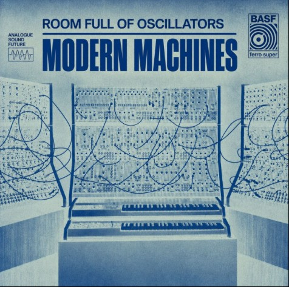

# Analogue Sound Future — website

Kant-en-klare, simpele website (puur HTML + CSS, geen build-stap nodig) om gratis te hosten via GitHub Pages.

## Wat zit erin

```
index.html          → de hele site (1 bestand)
images/banner.jpg    → je banner, is al toegevoegd
images/foto.jpg      → jouw foto — voeg je zelf toe (zie "Foto toevoegen" hieronder)
README.md            → dit bestand
```

## Stap 1 — Zet 'm online via GitHub Pages

1. Maak een gratis account op [github.com](https://github.com) als je die nog niet hebt.
2. Klik rechtsboven op **+** → **New repository**.
   - Naam: bijvoorbeeld `analogue-sound-future`
   - Zet 'm op **Public**
   - Klik **Create repository**
3. Op de nieuwe (lege) repository-pagina: klik **Add file** → **Upload files**.
4. Sleep de bestanden `index.html`, `README.md` en de map `images` (met daarin `banner.jpg`) in het uploadvak.
5. Klik onderaan op **Commit changes**.
6. Ga naar **Settings** (tabblad bovenin) → **Pages** (in het linkermenu).
7. Bij **Build and deployment** → **Source**: kies **Deploy from a branch**.
8. Bij **Branch**: kies `main` en map `/ (root)` → **Save**.
9. Ververs de pagina na ongeveer een minuut — bovenaan verschijnt je link, iets als:
   `https://jouwgebruikersnaam.github.io/analogue-sound-future/`

Klaar — dat linkje werkt overal, geen download nodig.

## Stap 2 — Inhoud aanpassen

Open `index.html` in een teksteditor (bijv. Kladblok, TextEdit, of gratis [VS Code](https://code.visualstudio.com)). Alle tekst staat gewoon leesbaar tussen de HTML-tags. Wijzig een tekst, sla op, en upload het bestand opnieuw via **Add file → Upload files** (je mag het bestaande bestand overschrijven) om de wijziging live te zetten.

### Bio-tekst
Zoek de sectie `<section class="section" id="bio">` en vervang de tekst in de `<p>`-blokken door je eigen bio. Wil je een extra alinea? Kopieer een heel `<p>...</p>`-blok en pas de tekst aan.

### Foto toevoegen
1. Noem je fotobestand exact `foto.jpg` en zet het in de map `images`.
2. Zoek in `index.html` het blok met `class="photo-placeholder"` en vervang dat hele blok door:
   ```html
   <div class="photo-wrap"></div>
   ```

### Bandcamp embedden
1. Ga naar je album of track op Bandcamp → knop **Share / Embed**.
2. Kies een formaat en kopieer de volledige `<iframe>`-code die Bandcamp je geeft.
3. Zoek in `index.html` het `<div class="embed-frame bandcamp">`-blok en plak je iframe-code in plaats van de `<p class="embed-empty-note">`-regel.

### SoundCloud embedden
1. Ga naar je track of playlist op SoundCloud → **Share** → tabblad **Embed**.
2. Kopieer de `<iframe>`-code.
3. Plak die in het `<div class="embed-frame soundcloud">`-blok, in plaats van de placeholder-regel.

### YouTube Music playlist embedden
YouTube Music heeft zelf geen embed-knop, maar gebruikt dezelfde playlist-ID's als gewoon YouTube:
1. Kopieer je playlist-link, bijvoorbeeld `https://music.youtube.com/playlist?list=PLxxxxxxxxxxxxxxxx`
2. Alles ná `list=` is het playlist-ID.
3. Vervang in `index.html`, in het `<div class="embed-frame youtube">`-blok, de placeholder-regel door:
   ```html
   <iframe src="https://www.youtube.com/embed/videoseries?list=PLxxxxxxxxxxxxxxxx" allowfullscreen></iframe>
   ```
   (met jouw eigen playlist-ID in plaats van `PLxxxxxxxxxxxxxxxx`)

### Kleuren en lettertype aanpassen
Bovenin `index.html` staat een `:root { ... }` blok in de `<style>`-sectie met alle kleuren op één plek (`--bg`, `--navy`, enz.) — verander een kleurcode en de hele site past zich aan.
